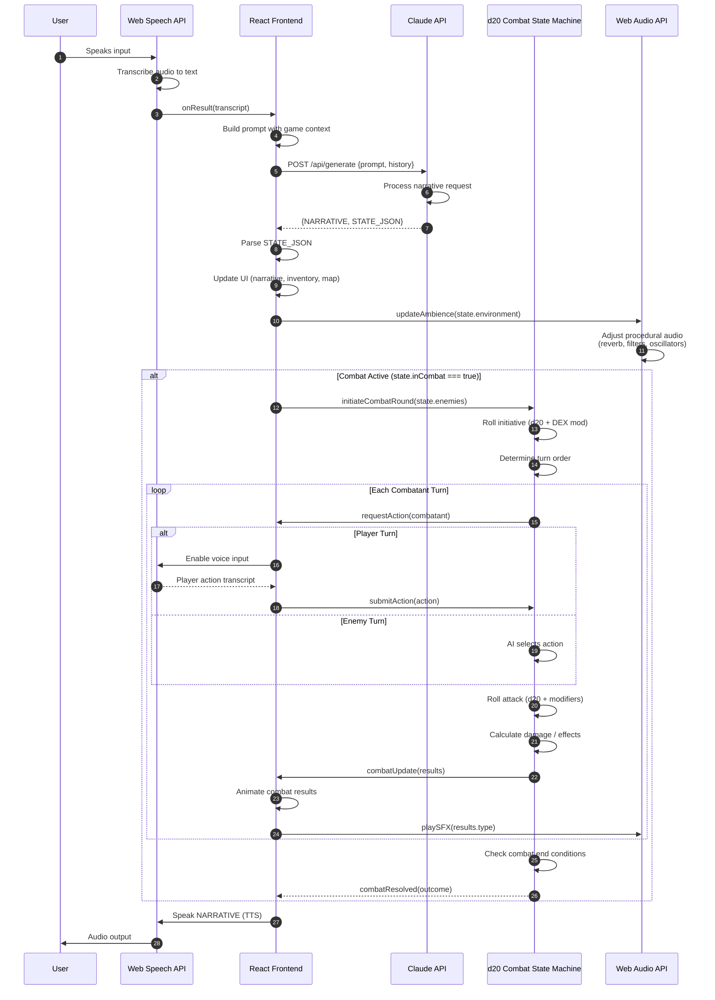

# AI Dungeon Master


A voice-controlled D&D game engine where AI acts as a living Game Director. Speak your actions, and the AI drives scene transitions, quests, combat, visual effects, and procedural audio in real-time.

## Overview

This is not a chatbot with a fantasy skin. The AI controls the game engine directly.

Every response from the AI returns structured output in two parts:

```
<NARRATIVE>
The tavern door creaks open. Greta looks up from polishing a tankard...
</NARRATIVE>

<STATE_JSON>
{
  "scene": "tavern",
  "mood": "calm",
  "suggestedActions": ["Talk to Greta", "Approach the hooded figure", "Order a drink"],
  "musicPreset": "tavern"
}
</STATE_JSON>
```

The frontend parses `STATE_JSON` and applies it to the game state machine. Scene changes trigger CSS gradient transitions. Mood shifts adjust vignette intensity and particle behavior. Music presets crossfade procedural ambient audio. The AI does not just describe the world, it controls it.

## Architecture

```
                                    GAME LOOP
    ┌─────────────────────────────────────────────────────────────────────┐
    │                                                                     │
    │   ┌──────────────┐      ┌─────────────────┐      ┌──────────────┐  │
    │   │  Voice Input │      │   Node.js API   │      │  Vertex AI   │  │
    │   │  (Web Speech │─────▶│   (Express +    │─────▶│  Gemini 2.0  │  │
    │   │     API)     │      │   CORS proxy)   │      │    Flash     │  │
    │   └──────────────┘      └─────────────────┘      └──────┬───────┘  │
    │                                                         │          │
    │                         STRUCTURED OUTPUT               │          │
    │                    ┌────────────────────────────────────┘          │
    │                    │                                               │
    │                    ▼                                               │
    │   ┌────────────────────────────────────────────────────────────┐   │
    │   │                    Director Module                         │   │
    │   │  parseResponse() → <NARRATIVE> + <STATE_JSON>              │   │
    │   │  applyStatePatch() → updates scene, mood, quests, rewards  │   │
    │   └────────────────────────────────────────────────────────────┘   │
    │                    │                                               │
    │        ┌───────────┼───────────┬───────────────┐                   │
    │        ▼           ▼           ▼               ▼                   │
    │   ┌─────────┐ ┌─────────┐ ┌─────────┐   ┌───────────┐              │
    │   │SceneFX  │ │ Audio   │ │  Quest  │   │  Action   │              │
    │   │CSS grad │ │Manager  │ │ Journal │   │   Chips   │              │
    │   │particles│ │Web Audio│ │ UI      │   │  (click)  │──┐           │
    │   └─────────┘ └─────────┘ └─────────┘   └───────────┘  │           │
    │                                                        │           │
    │                                     ┌──────────────────┘           │
    │                                     │                              │
    │                                     ▼                              │
    │                              NEXT PLAYER INPUT                     │
    │                                                                    │
    └────────────────────────────────────────────────────────────────────┘
```

### Key Components

| Module | Purpose |
|--------|---------|
| `director.js` | Parses `<NARRATIVE>` + `<STATE_JSON>`, applies state patches to game engine |
| `scene-fx.js` | CSS gradient backdrops, particles (embers/leaves/wisps/dust/snow), mood vignettes |
| `audio.js` | Procedural ambient soundscapes and SFX via Web Audio API (zero audio files) |
| `dungeon-master.js` | Intent parsing, combat mechanics, NPC dialogue, conversation history |
| `voice.js` | Web Speech API for voice input/output with per-NPC voice variations |

## Why This Architecture

**Structured AI output over free-form chat.** The AI returns JSON state patches that deterministically control game state. Scene transitions, quest progress, and rewards are not inferred from narrative text, they are explicit commands from the AI to the game engine.

**Web Audio API for zero-dependency procedural audio.** Ambient soundscapes (tavern crackle, forest wind, ruins drone) and SFX (dice rolls, hits, heals, level-ups) are synthesized at runtime using oscillators, noise buffers, and filters. No audio files to load or license.

**CSS-only visual effects for performance.** Scene backdrops use layered CSS gradients with smooth transitions. Particles are DOM elements with CSS animations. Screen shake, flash, and glow-burst effects are CSS keyframes. No canvas, no WebGL, no dependencies.

**Vertex AI for low-latency responses.** Gemini 2.0 Flash provides sub-second response times for real-time gameplay. The system prompt enforces the `<NARRATIVE>` + `<STATE_JSON>` response format.

## Features

### AI Game Director
- Structured output format enforces deterministic state changes
- AI-generated suggested actions rendered as clickable chips
- Story recap endpoint for context-aware responses
- NPC mood tracking persists across conversations

### Voice I/O
- Web Speech API for voice commands
- Text-to-speech narration with configurable voices
- Per-NPC voice pitch/rate variations

### Procedural Audio
- Ambient soundscapes: tavern, town, forest, ruins, combat, camp
- SFX: dice roll, hit, critical, miss, heal, level-up, quest acquired, gold
- Crossfade transitions between ambient presets

### Visual Effects
- Dynamic CSS gradient backdrops per scene
- Particle systems: embers, leaves, wisps, dust, snow
- Mood-reactive vignette intensity and color shifts
- One-shot effects: screen shake, flash, glow-burst, fog-roll
- Campfire flicker animation for tavern/camp scenes

### Gameplay
- d20 combat system with attack rolls, skill checks, critical hits
- Quest journal with active/completed/failed states
- Character creation: 6 races, 6 classes, 6 backgrounds
- Inventory and gold management
- localStorage persistence with save slots

## Tech Stack

| Layer | Technology |
|-------|------------|
| Frontend | Vanilla JavaScript (ES6+), CSS3 Custom Properties |
| Audio | Web Audio API (procedural synthesis) |
| Voice | Web Speech API (recognition + synthesis) |
| Backend | Node.js, Express, CORS |
| AI | Vertex AI Gemini 2.0 Flash |
| Storage | localStorage |
| Hosting | Vercel (frontend), GCP Cloud Run (backend) |

## Getting Started

### Prerequisites
- Node.js 18+
- GCP project with Vertex AI API enabled, or a Gemini API key

### Local Development

1. Clone the repository:
```bash
git clone https://github.com/rahulmehta25/AI-Dungeon-Master.git
cd AI-Dungeon-Master
```

2. Set up the backend:
```bash
cd server
npm install
cp .env.example .env
```

3. Configure environment variables in `.env`:
```bash
# Option A: Vertex AI (recommended for production)
GOOGLE_CLOUD_PROJECT=your-gcp-project-id
VERTEX_AI_LOCATION=us-central1

# Option B: Gemini API key (simpler setup)
GEMINI_API_KEY=your-api-key
```

4. Start the server:
```bash
npm start
# Server runs on http://localhost:3001
```

5. Serve the frontend:
```bash
# From project root
python3 -m http.server 8080
# Or use any static file server
```

6. Open http://localhost:8080

## Deployment

### Frontend (Vercel)

The frontend is static HTML/JS/CSS. Deploy to Vercel:

1. Push to GitHub
2. Import to Vercel
3. Set API proxy in `vercel.json`:

```json
{
  "rewrites": [
    { "source": "/api/:path*", "destination": "https://your-backend-url.run.app/api/:path*" }
  ]
}
```

### Backend (GCP Cloud Run)

1. Build and push the container:
```bash
cd server
gcloud builds submit --tag gcr.io/PROJECT_ID/ai-dungeon-master
```

2. Deploy to Cloud Run:
```bash
gcloud run deploy ai-dungeon-master \
  --image gcr.io/PROJECT_ID/ai-dungeon-master \
  --platform managed \
  --region us-central1 \
  --allow-unauthenticated \
  --min-instances 0 \
  --max-instances 2
```

The backend uses Application Default Credentials when running on GCP, so no API key is needed if Vertex AI is enabled on the project.

## Project Structure

```
AI-Dungeon-Master/
├── index.html              # Main HTML
├── css/
│   ├── styles.css          # Theme, layout, glassmorphic cards
│   └── animations.css      # Keyframes, transitions
├── js/
│   ├── app.js              # App shell, UI management
│   ├── director.js         # AI output parser, state patcher
│   ├── dungeon-master.js   # Game logic, NPC dialogue, combat
│   ├── scene-fx.js         # CSS backdrops, particles, effects
│   ├── audio.js            # Procedural audio synthesis
│   ├── voice.js            # Speech recognition/synthesis
│   ├── combat.js           # Dice rolling, attack calculations
│   ├── character.js        # Character creation, stats
│   └── storage.js          # localStorage persistence
├── server/
│   ├── server.js           # Express API, Vertex AI client
│   ├── Dockerfile          # Cloud Run container
│   └── package.json
├── vercel.json             # API proxy rewrites
└── README.md
```

## License

MIT License

---

Built by [Rahul Mehta](https://github.com/rahulmehta25)

## System Architecture Diagram



